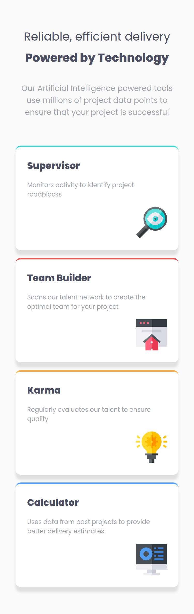
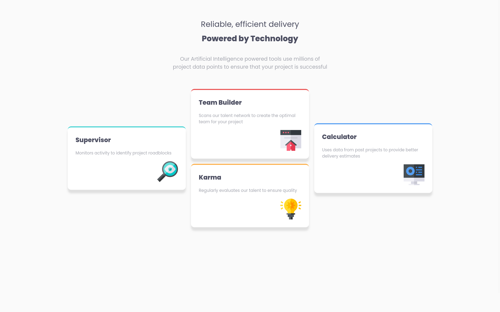

# Frontend Mentor - Four card feature section solution

This is a solution to the [Four card feature section challenge on Frontend Mentor](https://www.frontendmentor.io/challenges/four-card-feature-section-weK1eFYK). Frontend Mentor challenges help you improve your coding skills by building realistic projects. 

## Table of contents

- [Overview](#overview)
  - [The challenge](#the-challenge)
  - [Screenshot](#screenshot)
  - [Links](#links)
- [My process](#my-process)
  - [Built with](#built-with)
  - [What I learned](#what-i-learned)
  - [Useful resources](#useful-resources)
- [Author](#author)

## Overview

### The challenge

Users should be able to:

- View the optimal layout for the site depending on their device's screen size

### Screenshot

### Links

- Solution URL: [Github repo](https://github.com/IbrahimMurad/four-card-feature-section-master/)
- Live Site URL: [Live site](https://ibrahimmurad.github.io/four-card-feature-section-master/)

## My process

### Built with

- Semantic HTML5 markup
- CSS custom properties
- Flexbox
- CSS Grid
- Mobile-first workflow
- [Sass](https://sass-lang.com/)

### What I learned

Playing with flex box and grid is always fun. I learned how to use them in a better way.

### Useful resources

- [An Interactive Guide to Flexbox by Josh Comeau](https://www.joshwcomeau.com/css/interactive-guide-to-flexbox/) - This helped me to understand flexbox in a better way.
- [An Interactive Guide to CSS Grid by Josh Comeau](https://www.joshwcomeau.com/css/interactive-guide-to-grid/) - This helped me to understand grid in a better way.

## Author

- Website - [Github](https://github.com/ibrahimmurad/)
- Frontend Mentor - [IbrahimMurad](https://www.frontendmentor.io/profile/IbrahimMurad)